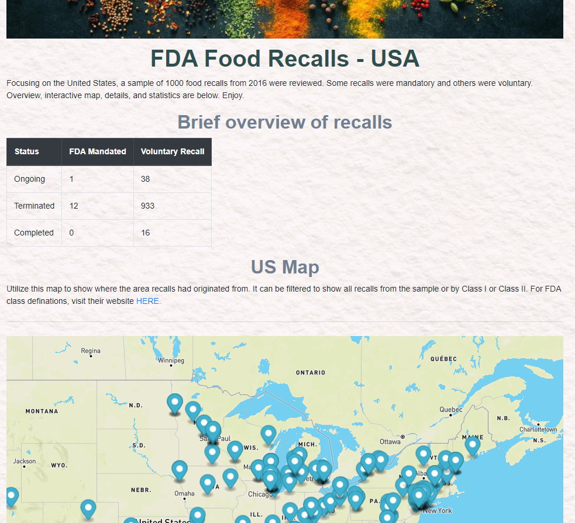

# FDA Recalls 

## Background
Tell a story using data visualizations allowing users to interact and explore data themselves. For our story, we are focusing on FDA Recalls using a live dataset. 

## Languages & Datasets used: 
* FDA API 
* json
* Zippopotam API
* JavaScript
* HTML
* CSS
* Python
* Pandas
* Mapbox
* matplotlib
* pymongo
* flask 
* MongoDB

## Link to Website
To be added 

## Features 
A sample of 1000 FDA food recalls were called from an FDA API. Data was filtered and cleaned. Zip code was added to the city from combining FDA data to Zippopotam API call. Using languages and datasets above, a website was created. This page is user friendly and shows a brief overview of the recalls sampled, a US Map allowing the user to filter and click on pinpoints within the map for more recall information, and a complete list of the sampled recalls. 

	

The data also provided the classification of the recall. To assist users, a link to the FDA definitions added for reference. 

https://www.fda.gov/safety/industry-guidance-recalls/recalls-background-and-definitions

## Goal
The goal of using this data was to organize the FDA's list by location and to provide a visual. 

## Contributors 
* Andy: https://github.com/andyob715
* Jake: https://github.com/JakeRose689
* Stacey: https://github.com/staceyj118
